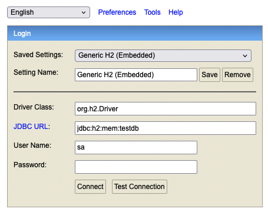

# Card transaction Routines

Each cardholder (customer) has an account with their data. For each operation performed by the customer, a transaction is created and associated with their respective account. 
Each transaction has a type ("COMPRA A VISTA", "COMPRA PARCELADA", "SAQUE" or "PAGAMENTO"), an amount and a creation date.
Purchase and withdrawal type transactions are recorded with a negative value, while payment transactions are recorded with a positive value.

# How to run the application

## Pre-requisites:
It's required java 17, maven to run the project.

These instructions below require Docker to execute.

## Run
I included a run.sh file in the project root folder.
To run the application, just run this command in the terminal:

```
./run.sh
```

Maybe you need to execute this command before run the run.sh file, in order to grant permission to this file: 
```
chmod +x run.sh
```

The run.sh file executes ```mvn clean package ``` command to create the jar file, then executes the docker file.
The "Dockerfile" is documented with some comments explaining everything.
The docker-compose.yml file has all services that are executed. The first one is this spring boot application.
Other services are the Prometheus and Grafana.

If you are still struggle to execute the run file, alternatively execute this in your terminal:

```
mvn clean package

docker-compose up --build
```

# Endpoints

To access the documentation of the endpoints, use the swagger link:
http://localhost:8080/swagger-ui/index.html#/

# Decisions

## Project structure

I created the project structure based in clean architecture and hexagonal arch.
Since it's a small project, I didn't create many layers and a complex structure of directories.

```
-- adapter
     | -- controller
     | -- infrastructure
            | -- h2
                  | -- repository
                  | -- entity
-- domain
     | -- usecases
     | -- ports
     
 ```

The endpoints are in the controller layer. These endpoints call the useCases classes that are in the domain layer.

These useCases can call domain classes and infrastructure layer. To access an implementation in infrastructure layer, the
services must call the interface Port. The idea is each interface port has at least one implementation.
In our case, Port interfaces are implemented by Repository classes.
For example, we have the `AccountPort`. The implementation of this interface is `AccountRepository`. `AccountRepository` has its own H2 implementation
of how to create and find an account.

If in the future, we want to create a specific microservice for account management, so we change the implementation of `AccountPort` from `AccountRepository` to `AccountRest`. But the interface don't change.
We continue call the getAccount interface method in the domain. So, if the change was in the infrastructure technology, so the domain should not change, in theory.

## Database

I created an attribute called `multiplier` in the `operation_types` table to make the code easier to maintain.
So if it's a debit transaction, the multiplier is -1, if it's not, it's 1. I think it's great to have this in the database 
because you don't have to change the code and deploy the code if you create a new type of operation.

For example, if tomorrow it is necessary to add the cashback operation type, simply insert this sql below into the database:
```
insert into operation_types (id, description, multiplier) values (5, 'CASHBACK',  1)
```

There is a file called `data.sql` that inserts 4 operation types when the application starts.

Another change I made to the proposed data model structure was to change the account ID type from Long to UUID. 
This is important so that we don't need to expose the data customers.
Since the ID is a sequence number, it's easy for someone to call the get accounts/{accountId} endpoint many times in sequence and find out all customers and their data.
So, using UUID we prevent our server from this type of attack. However, UUID are less performant.

## H2

H2 is an embedded in-memory SQL database that is great for use in case of testing applications. I chose this database because it reduces development time since we don't need to create the schemas, just create the JPA entities.
However, it is not a good use case for real applications.

To open the H2 console (user and password are in the application.properties):

```
http://localhost:8080/h2-console/
```
the jdbc url(it's in the application.properties as well): `jdbc:h2:mem:testdb`



There is a file called `data.sql` that insert 4 operation types when the application starts.

## Caffeine

Since I created a single server application, I chose Caffeine as cache technology. I'm using the caffeine cache for local cache 
in parts of code that don't change a lot, like OperationType.

## Prometheus and Grafana

Prometheus and Grafana are very good open source monitoring tools. We can monitor the number of requests per second per endpoint, 
the response time per endpoint, memory and cpu use etc.

To access Prometheus:
```
http://localhost:9090/
```

To access Grafana: 
```
http://localhost:3000/login
```

Grafana dashboard that I created:


## Unit and integration tests

I created unit tests for domain and repository classes. 

I created the integration test using mock mvc, calling the endpoint directly and asserting if the response status and body is correct as expected.
In addition to it, we are checking if the data(new transactions and accounts) was saved correctly.

# Future

I think if we want to deploy this application in production environment we need to do some modifications.

## Database

First of all, change the H2 database to other one.
The idea is to choose a database that it's not in memory, but it could be deployed in a cloud service, for example.
I would choose a SQL database in this case since we want a database that guarantees the consistency instead of availability in according to CAP Theorem.
Some options of SQL database are postgres, Mysql, Oracle and cockroachDB. The last two are designed to be distributed and scaled horizontally.

## Cache

The operation type is cached locally, which means that each application server will have its own cache in memory. So, one server may have information cached while another server does not.
But I believe that this is not a problem in this case, since we have few operation types values, and they don't usually change much. 
However, it's important to note that if an operation type data is changed or deleted, it's necessary to wait for the TTL to expire to view the modification.

Create a distributed cache for Account would be a very good strategy. We can use a redis, memcached or Hazelcast.
An important consideration is everytime an account changes(e.g. client changed for active to inactive status) we need to invalidate the cache.
